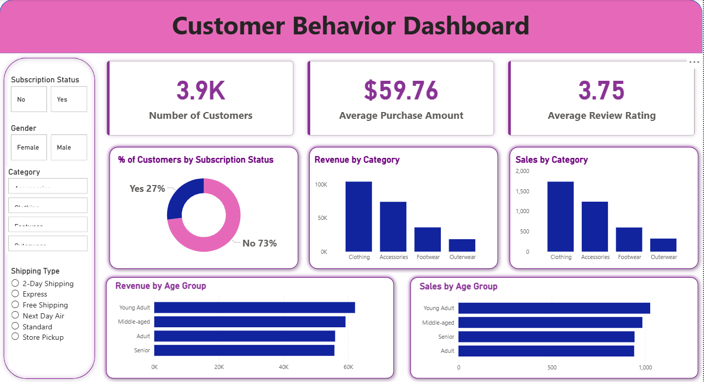

# 🛍️ Customer Sales Data Analysis

## 📌 Project Overview

This project explores customer shopping behavior using transactional data to uncover meaningful insights that can support business decision-making. The analysis focuses on identifying purchasing trends, customer segments, and key factors influencing spending patterns.

The goal is to transform raw data into actionable insights using a combination of **Python, SQL, and Power BI**.

---

## 🎯 Business Objective

To answer the core question:

**How can customer shopping data be used to improve marketing strategies, customer engagement, and overall business performance?**

---

## 📊 Dashboard Preview



---

## 📊 Dataset Summary

* **Total Records:** 3,900 transactions
* **Features:** 18 columns
* **Data Includes:**

  * Customer demographics (age, gender, location)
  * Purchase details (category, amount, season)
  * Behavioral insights (discount usage, reviews, purchase frequency)

---

## 🛠️ Tools & Technologies

* **Python** – Data cleaning, preprocessing, and feature engineering
* **PostgreSQL** – Data analysis and querying
* **Power BI** – Data visualization and dashboard creation

---

## 🔄 Project Workflow

### 1. Data Preparation (Python)

* Cleaned missing values (review ratings handled using median)
* Standardized column names
* Created new features:

  * Age groups
  * Purchase frequency metrics
* Loaded processed data into PostgreSQL

---

### 2. Data Analysis (SQL)

Performed business-driven analysis including:

* Revenue comparison by gender
* Identification of high-spending customers using discounts
* Top-rated products analysis
* Shipping type impact on spending
* Customer segmentation (New, Returning, Loyal)
* Revenue contribution by age group

---

### 3. Data Visualization (Power BI)

Developed an interactive dashboard featuring:

* Key performance indicators (KPIs)
* Customer segmentation insights
* Revenue trends by category and age group
* Subscription and purchase behavior analysis

---

## 📈 Key Insights

* Discount users can still be high-value customers
* Express shipping customers tend to spend more
* A large portion of customers fall into the “loyal” segment
* Certain product categories consistently receive higher ratings

---

## 💡 Business Recommendations

* Introduce targeted loyalty programs to retain high-value customers
* Optimize discount strategies to balance revenue and profit
* Promote top-rated products in marketing campaigns
* Focus on high-performing customer segments for targeted outreach

---

## 📁 Project Structure

```
Customer-Sales-Data-Analysis/
│
├── data/                # Dataset file
├── python/              # Jupyter notebook for analysis
├── sql/                 # SQL queries
├── powerbi/             # Power BI dashboard file
├── reports/             # Project report & presentation
└── README.md            # Project documentation
```

---

## 🚀 How to Run the Project

1. Clone the repository
2. Open the Jupyter Notebook and run the Python analysis
3. Load the processed data into PostgreSQL
4. Execute SQL queries for insights
5. Open the Power BI file to explore the dashboard

---

## 📌 About This Project

This project was developed as part of a hands-on learning experience to apply data analysis techniques in a real-world business scenario. It demonstrates end-to-end skills from data cleaning to visualization and insight generation.

---

## ⭐ If you found this useful

Feel free to star the repository and explore more projects!
